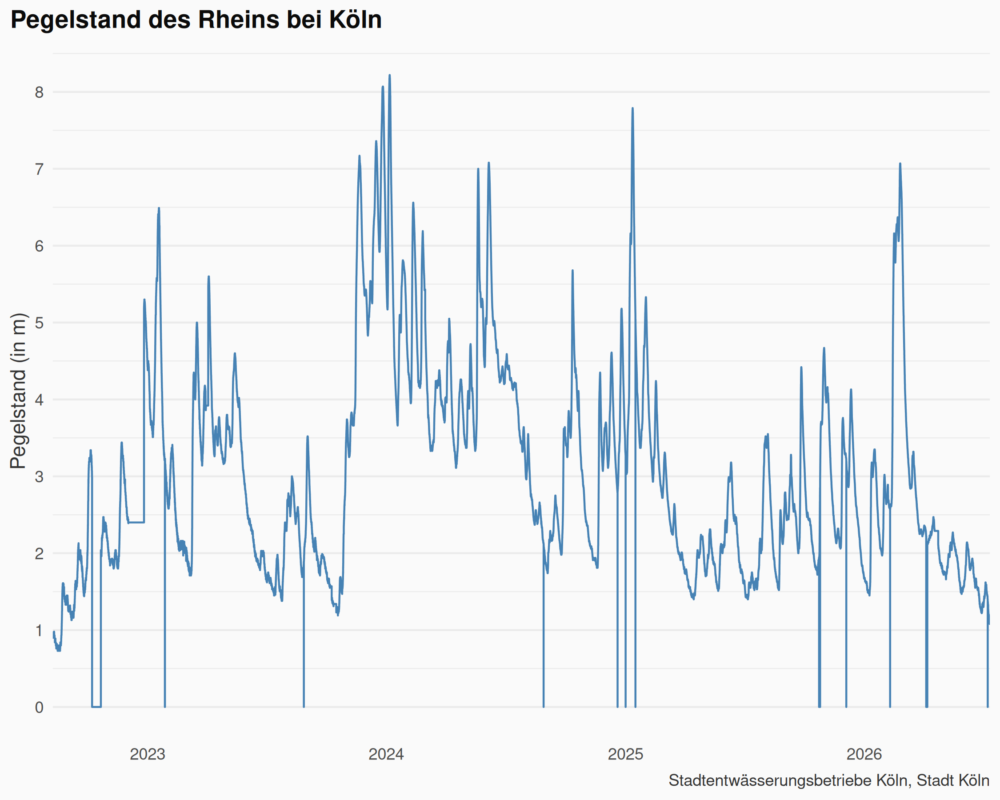
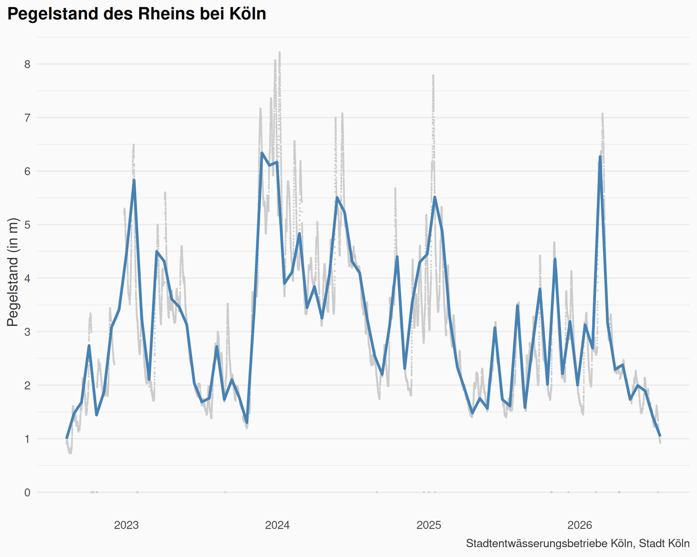
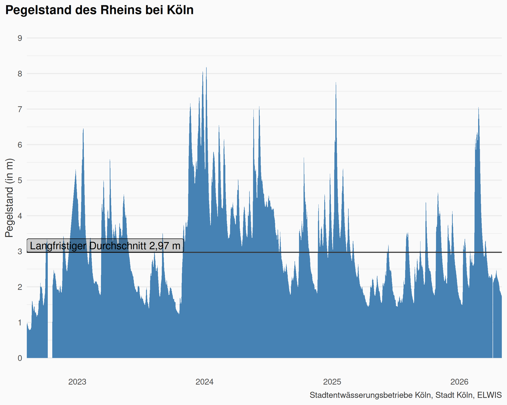

# Aktueller Pegelstand des Rheins, Köln
Script that fetches and stores the current water level of the Rhine in Cologne, Germany

Source: Stadtentwässerungsbetriebe Köln, Stadt Köln [Offene Daten Köln](https://www.offenedaten-koeln.de/dataset/resource/2c576a84-337d-483f-ae72-15c9527049b5) 
Licence: [Datenlizenz Deutschland – Zero – Version 2.0](https://www.govdata.de/dl-de/zero-2-0)

## Pegelstand aktuell

`Sys.time()`

  

  

## Github Actions Workflow
<!-- badges: start -->

<!-- badges: end -->
