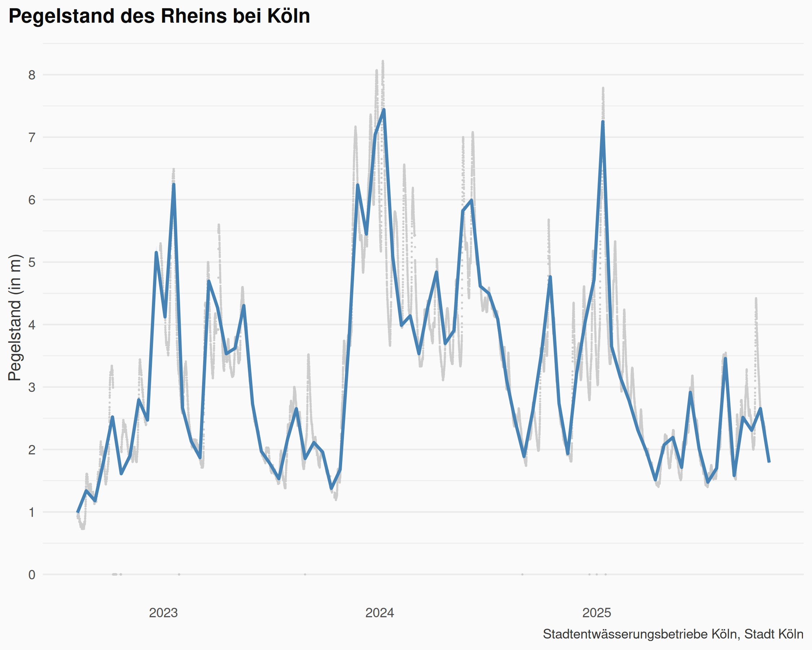
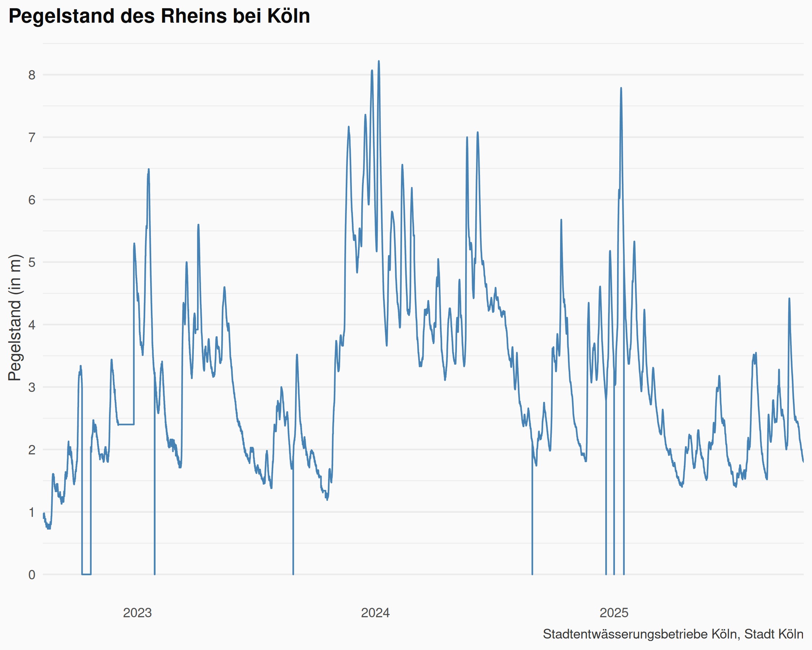
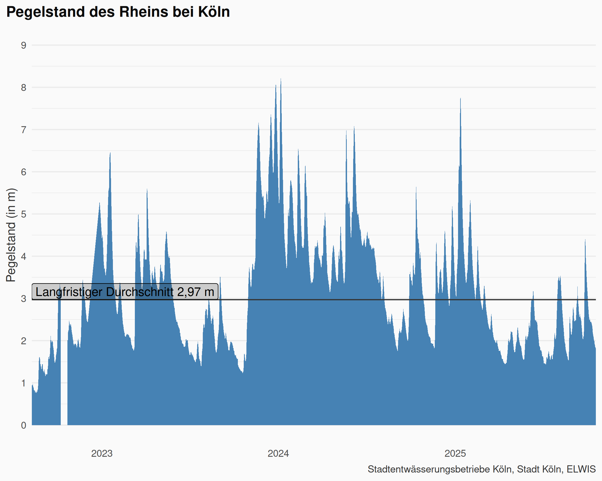

# Aktueller Pegelstand des Rheins, Köln

Quelle: Stadtentwässerungsbetriebe Köln, Stadt Köln [Offene Daten Köln](https://www.offenedaten-koeln.de/dataset/resource/2c576a84-337d-483f-ae72-15c9527049b5) 
Lizenz: [Datenlizenz Deutschland – Zero – Version 2.0](https://www.govdata.de/dl-de/zero-2-0)

## Pegelstand aktuell

  

  

## Pegelstand und Wassertiefe

[https://www.swr.de/swraktuell/rheinland-pfalz/was-ist-ein-pegel-erklaerung-100.html](https://www.swr.de/swraktuell/rheinland-pfalz/was-ist-ein-pegel-erklaerung-100.html)

## Github Actions Workflow
<!-- badges: start -->

<!-- badges: end -->
